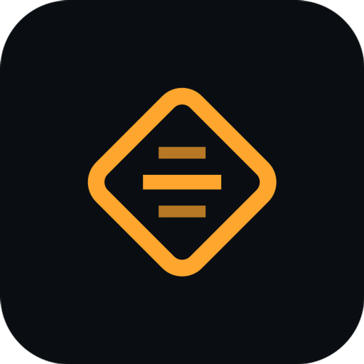

# Deckodex MCP

**Gundam Card Game cards, prices, tournament meta, and your collection — inside your AI assistant.**

Deckodex is a remote [Model Context Protocol](https://modelcontextprotocol.io) server for the
[Gundam Card Game](https://www.gundam-gcg.com/). Connect it to Claude, ChatGPT or any MCP client and ask
about cards, prices and the meta, and — once you sign in — about your own Deckodex collection and decks.
Every answer links back to the matching page on [deckodex.com](https://deckodex.com).

> This repository holds the listing metadata (`server.json`). The server itself is hosted by Deckodex;
> there is nothing to install.

## Connect

| | |
|---|---|
| **Server URL** | `https://deckodex.com/mcp` |
| **Transport** | Streamable HTTP |
| **Auth** | OAuth 2.1 (sign in with your Deckodex account; dynamic client registration + PKCE) |
| **Registry** | [`com.deckodex/deckodex`](https://registry.modelcontextprotocol.io/v0.1/servers?search=com.deckodex) |

- **Claude:** Settings → Connectors → Add custom connector → paste the URL.
- **ChatGPT:** Settings → Apps & Connectors → Create → paste the URL.
- **Other MCP clients:** add a remote (Streamable HTTP) server with the URL.

Setup guide: https://deckodex.com/assistant

## What you can ask

- "What are the top decks in GD05 right now, and what does the best list cost to build?"
- "Which meta decks am I closest to building from my collection, and what's missing?"
- "Is Strike Freedom Gundam (GD05-002) going up in price? Show me every printing."
- "Check this decklist for legality and price it."
- "What's my collection worth, and what's the cheapest way to finish GD04 as playsets?"

Prices follow your Deckodex currency preference — TCGplayer (USD) or CardTrader (EUR) — with
Cardmarket's current EUR price alongside.

## Tools

| Tool | What it does | Access |
|---|---|---|
| `search_cards` | Search the card catalog | Free |
| `get_card` | Card details, rulings, prices per printing, 30/90-day trends | Free |
| `get_meta` | Tournament tier list for a format | Free |
| `get_archetype` | An archetype's core cards and top lists | Free |
| `get_meta_deck` | A full tournament decklist | Free |
| `validate_deck` | Check a decklist's legality and price | Free |
| `market_movers` | Biggest price gainers and losers | Free |
| `price_list` | Most valuable cards overall, by set or rarity | Free |
| `my_collection` | Your collection and set progress | Free (sign-in) |
| `my_decks` | Your decks and what you still need | Free (sign-in) |
| `buildable_meta_decks` | Meta decks you can almost build | Free (sign-in) |
| `my_set_completion` | Set completion and cost to finish | Free (sign-in) |
| `my_collection_value` | Collection value — headline free, full analytics with Pro | Free / Pro |
| `best_buys` | Best cards to buy next for meta decks | Pro |
| `save_deck` | Save a deck to your account | Pro |
| `update_collection` | Update owned counts | Pro |
| `add_to_list` | Add cards to your lists | Pro |

The connector can never delete your decks or lists. Disconnect it any time in
[Deckodex Settings](https://deckodex.com/settings). Pro: https://deckodex.com/pricing

## Privacy & support

- Privacy policy: https://deckodex.com/privacy (see "AI assistant connectors")
- Terms: https://deckodex.com/terms
- Contact: see the privacy policy

Deckodex is an unofficial fan-made tool, not affiliated with or endorsed by the publishers of the games it covers.
